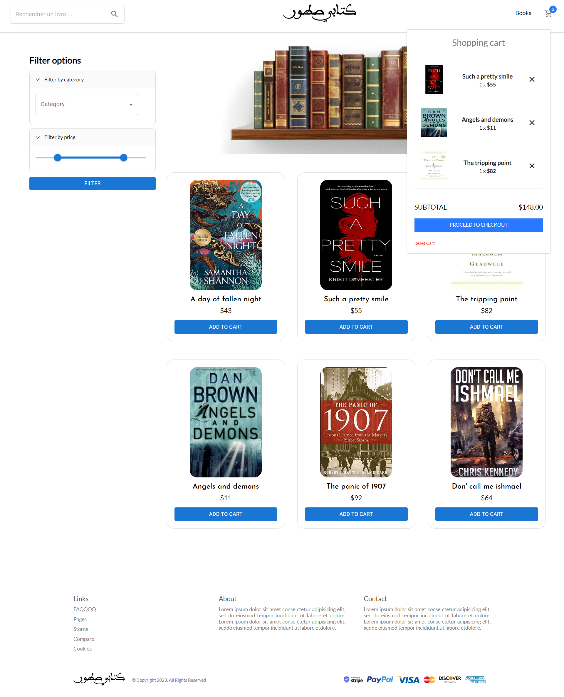
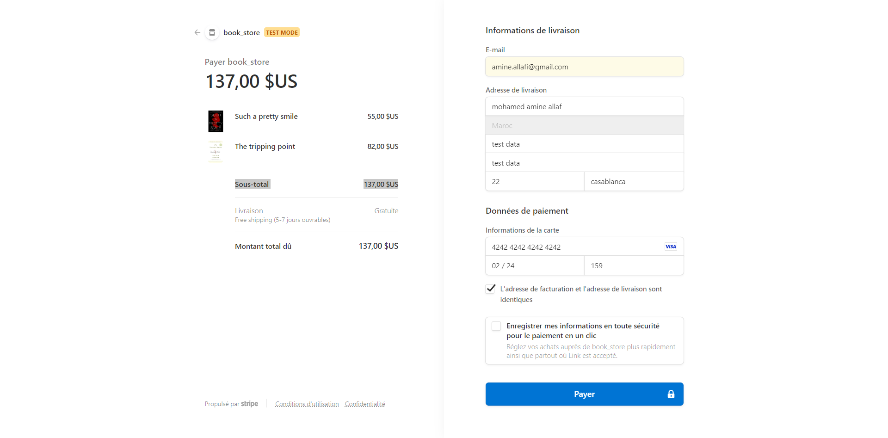

📚 Book Store Application
A full-featured MERN stack web application for browsing, managing, and purchasing books online. Built with MongoDB, Express.js, React.js, Node.js, and integrated with Stripe for payments. Features include Redux for state management and JWT for secure user authentication.

🚀 Tech Stack
MongoDB – NoSQL database for storing book, user, and order data.

Express.js – Backend web framework for API routes and business logic.

React.js – Frontend library for building reusable UI components.

Node.js – JavaScript runtime for building scalable backend services.

Redux – Centralized state management for predictable UI behavior.

JWT (JSON Web Token) – Secure user authentication and route protection.

Stripe API – Seamless and secure payment processing.

🎯 Key Features
🧑‍💻 User Features
Feature	Description
🏠 Home Page	A clean, welcoming landing page.
📚 Book Catalog	Browse, search, and view detailed book listings.
🛒 Shopping Cart	Add books to cart and proceed to checkout.
💳 Secure Checkout	Review cart, add address, and proceed to payment.
💰 Stripe Payment Gateway	Safe and smooth transactions using Stripe.
📦 Order Management	Track order history and order details.
🔍 Search & Filters	Search by title, author, category, and more.
📱 Responsive UI	Optimized for mobile, tablet, and desktop.

Screenshots:

Feature	Preview
Home	
   

Catalog	
Cart	
   
Checkout	
   
Stripe	
   
Orders	

🛠️ Admin Features
Feature	Description
🔐 Admin: Login	Secure login with elevated privileges.
📘 Book Management:	Add, update, or delete books.
🖼 Image Upload:	Upload cover images for books.
👤 User Management:	View and manage user accounts and roles.
🗂 Category Management:	Create and update book categories.

🛡️ Security Notice
⚠️ Sensitive data such as API keys and database credentials should never be hardcoded into source files.
Please store such values securely in a .env file and use dotenv in your Node.js code to load them:

j
require('dotenv').config();
const stripe = require('stripe')(process.env.STRIPE_SECRET_KEY);
📦 Getting Started
1. Clone the repository

git clone https://github.com/your-username/your-repo-name.git
cd your-repo-name
2. Setup Backend

cd backend
npm install
touch .env
Add the following to .env:

MONGO_URI=your_mongodb_uri
JWT_SECRET=your_jwt_secret
STRIPE_SECRET_KEY=your_stripe_key

npm run server
3. Setup Frontend

cd ../frontend
npm install
npm start
✨ Contributing
Pull requests are welcome! For major changes, please open an issue first to discuss what you would like to change.

📄 License
This project is licensed under the MIT License.

